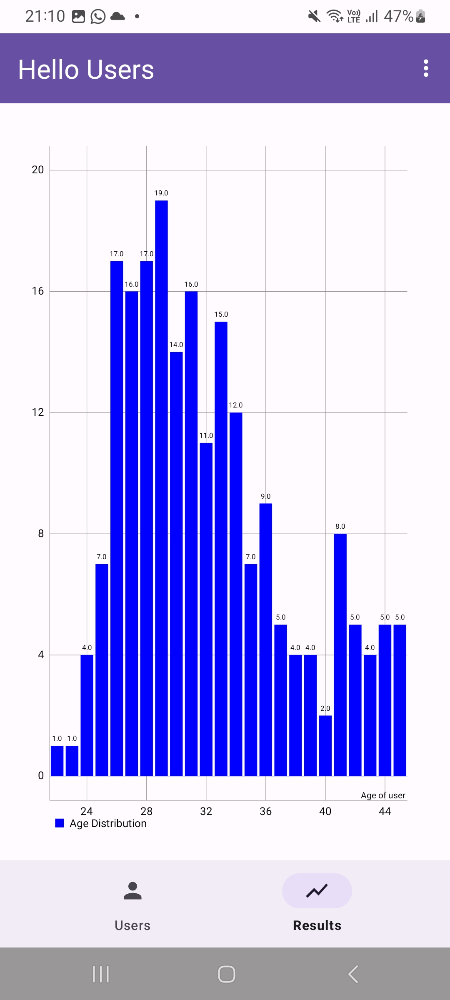
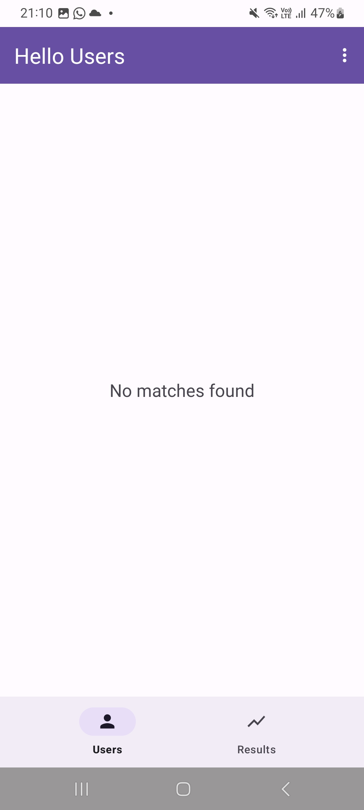
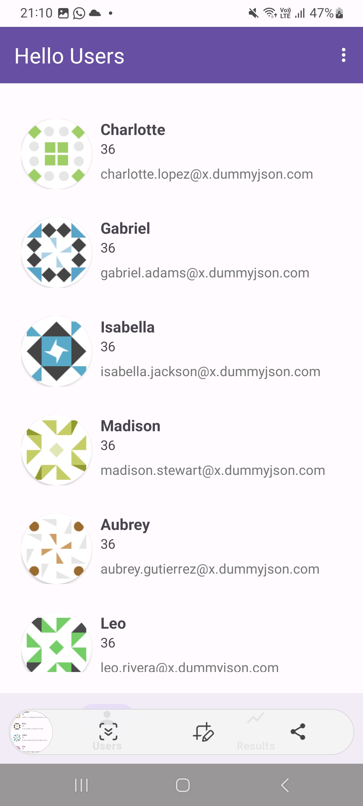

# Hello Users

## Overview

This project retrives user data from an API. We then use a function that generates a random age every 2.5 seconds and checks if any user in the list matches this age.
 We then update the UI by showing the user if available or else indicate no matches were found. Finally we record the results and display them in a graph within a separate fragment.
 Databinding is used to connect model User with the Views.

## MVVM Architecture
The MVVM (Model-View-ViewModel) architecture pattern is a design pattern that separates the development of the user interface from the development of the business logic.
This pattern is particularly useful in applications with complex UI, as it helps manage the separation of concerns, making the code more testable, and maintainable.

### Key Components:
**Model**: Represents the data and the business logic of the application. It manages the data and communicates with the network, database, or other data sources.

**View**: The UI layer that displays the data and interacts with the user. It observes the ViewModel for data changes and reflects them in the UI.

**ViewModel**: Acts as a bridge between the Model and the View. It exposes the data and operations needed by the View, processes user inputs, and handles the logic of updating the View.

### Benefits of MVVM:
**Separation of Concerns**: Each layer (Model, View, and ViewModel) has a distinct responsibility, making the codebase cleaner and more organized.

**Testability**: Since the ViewModel is separated from the View, you can write unit tests for the ViewModel without worrying about the UI.

**Reusability**: The same ViewModel can be reused with different Views, allowing for more flexible code reuse.
 
## Features

- Bar chart visualization of user age distribution.
- Dynamic updates based on age.

## Getting Started

### Prerequisites

- Android Studio with Kotlin support.
- MPAndroidChart library for charting.

### Installation

1. **Clone the Repository**

   Clone this repository to your local machine using the following command:

   ```bash
   git clone https://github.com/Felix50-dev/JamboPayTest
2. **Open the Project**

Open the project in Android Studio.

3. **Add Dependencies**

Add the necessary library dependency to your project. Ensure the MPAndroidChart library is included in your build configuration.

4. **Sync the Project**

Sync your project with Gradle files to download the required dependencies.

## Configuration
### Update Layout
Ensure your XML layout file includes a BarChart view. This view will be used to display the age distribution chart.Enable dataBinding by setting databinding = true.

### Setup Fragment/Activity
Configure your fragment or activity to initialize and manage the bar chart. This includes setting up data binding, chart appearance, and data updates.
Since we are using hilt, ensure to add @AndroidEntryPoint at the start of your fragments and activities.

## Usage
Running the Application
Launch the application on an emulator or physical device. Navigate to the main screen to see the functionality of the app.

### Viewing the UI
The bar chart will automatically update to reflect the latest user data. The x-axis represents age intervals, and the y-axis shows the number of users.
The users are refreshed every 2.5 seconds based on a certain age. If no user is available, we show a text with that information.

## Contributing
Contributions are welcome! If you have suggestions for improvements or would like to contribute code, please follow these guidelines:

Fork the repository and create a pull request with your changes.
Ensure your code adheres to the project's coding standards.
Write clear and concise commit messages.
## License
This project is licensed under the MIT License. See the LICENSE file for details.

## Contact
For questions or support, please contact:

Email: mwatufelix1@gmail.com
GitHub: Felix50-dev

## ScreenShot




## Demo
https://github.com/user-attachments/assets/ced6d1e1-e782-4110-acaf-69916c09af75


